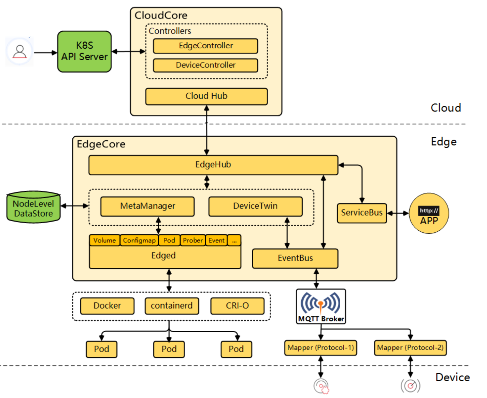

# 概述
ApulisEdge是

# 整体技术架构
ApulisEdge需要搭配kubernetes和kubeedge来使用，

## kubeedge
### 介绍
KubeEdge 是一个开源系统，可将本机容器化的业务流程和设备管理扩展到Edge上的主机。它基于Kubernetes构建，并为网络、应用程序部署以及云与边缘之间的元数据同步提供核心基础架构支持。它还支持MQTT，并允许开发人员编写自定义逻辑并在Edge上启用资源受限的设备通信。KubeEdge由云部分和边缘部分组成，边缘和云部分现已开源。

### 架构

### 文档
更为详细的文档请参见：https://github.com/kubeedge/kubeedge

## apulisedge
### 介绍

### 架构

# API接口

# 部署方式
TODO

     
