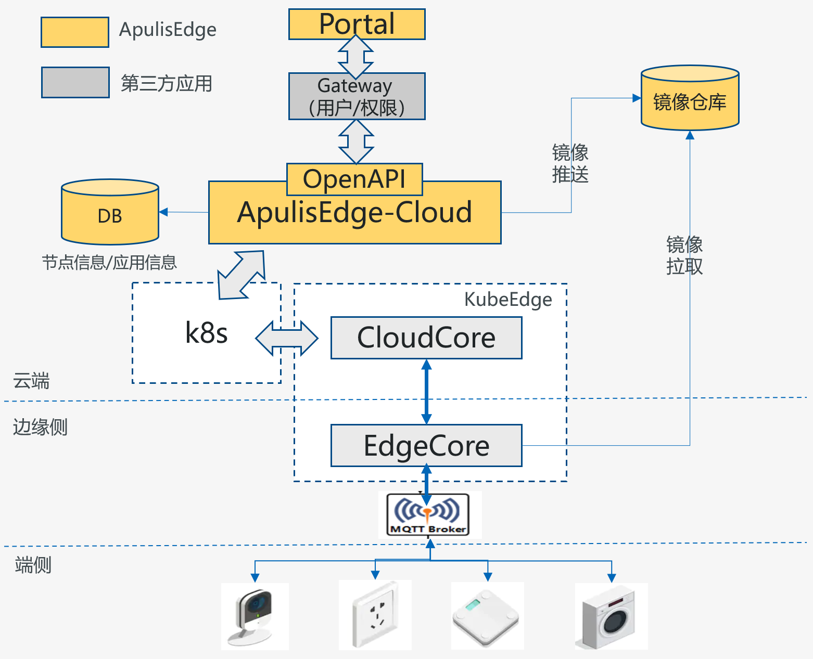
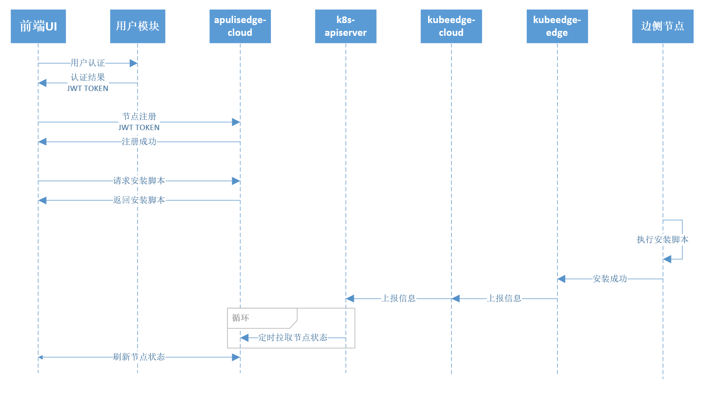
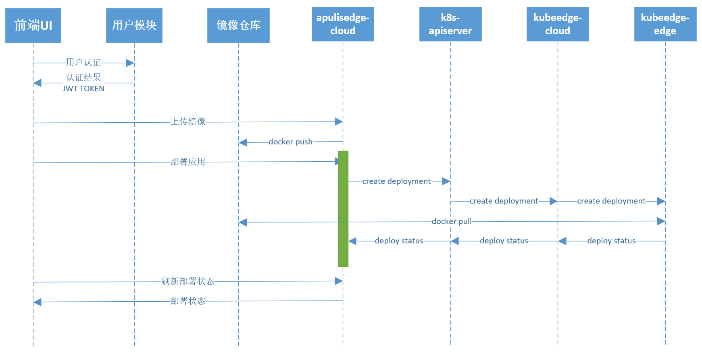

# 概述
ApulisEdge是依瞳科技开源的云-边-端协同组件，基于kubernetes和kubeedge的能力，打通云-边-端的应用场景，可以将边侧和端侧设备纳入统一的平台进行管理，并将kubernetes的容器部署、容器升级能力延展到边侧。

目前功能如下：
- 边侧设备注册、安装、管理
- 边侧应用管理及部署
- 容器镜像管理

# kubeedge
## 介绍
KubeEdge是一个开源系统，可将本机容器化的业务流程和设备管理扩展到Edge上的主机。它基于Kubernetes构建，并为网络、应用程序部署以及云与边缘之间的元数据同步提供核心基础架构支持。它还支持MQTT，并允许开发人员编写自定义逻辑并在Edge上启用资源受限的设备通信。KubeEdge由云部分和边缘部分组成，边缘和云部分现已开源。

## 文档
更为详细的文档请参见：https://github.com/kubeedge/kubeedge

# apulisedge
## 整体技术架构
ApulisEdge需要搭配kubernetes和kubeedge来使用，整体技术架构如下：



## 工作流程
### 节点管理
节点注册及安装



### 应用部署



# API接口
ApulisEdge协议格式兼容KubeEdge。

## 下行消息接口格式
下行接口表示Portal请求ApulisEdge-Cloud的消息，格式如下：
```json
{
"header": { 
"msg_id": "584a2d50-11d1-4d60-83ce-f0cc48a45348", 
"parent_msg_id": "",
"timestamp": 1550107087319, 
}, 
"route": { 
"source": "portal",  
"operation": "update", 
}, 
"content": { 
} 
}
```

## 上行消息接口格式
上行接口表示ApulisEdge回复给Portal的响应，格式如下：
```json
{
"header": { 
"msg_id": "584a2d50-11d1-4d60-83ce-f0cc48a45348", 
"parent_msg_id": "", 
"timestamp": 1550107087319, 
}, 
"route": { 
"source": "cloud", 
"operation": "response", 
}, 
"content":{ 
} 
}
```

## 字段说明
| 属性 | 类型 | 解释 |
|:------|:------|:------|
| msg_id | string | 对该消息的唯一标识，以便消息处理方进行去重、幂等性等操作，格式为UUID。|
| parent_msg_id | string | 该消息的父消息，格式为UUID，可以此表示request/response关系。<br> - 对于请求消息request，该字段为空。<br> - 对于应答消息response，该字段为请求消息的msg_id。|
| timestamp | int | 该消息的时间戳。|
| source | string | 消息源，即发送消息的模块，具体定义如下：<br> portal：web控制台。 <br> cloud：apulisedge cloud. |
| operation | string | 消息操作类型，字符串格式，Request取值为insert、update、delete、query等；Response统一为response. |
| content| json | 具体的消息内容，由各个组件自行定义。 |


## 节点管理接口
header和route的格式见上述介绍，下面的参数仅说明content字段。

| 接口路径 | 接口功能 | 参数说明 |
|-----------------|-----------------|-----------------|
| /apulisEdge/api/node/createNode | 注册节点 | "content":{"name":"ubuntu","nodeType":"Raspberrypi 4B"} <br> name: 边节点名称，同一用户下不能重复。 <br> nodeType：节点类型。 |
| /apulisEdge/api/node/listNode | 列举当前节点 | "content":{"pageNum":1,"pageSize":10} |
| /apulisEdge/api/node/desNode | 节点详情 | "content":{"name":"ubuntu"} <br> name: 边节点名称 |
| /apulisEdge/api/node/deleteNode | 删除节点 | "content":{"name":"ubuntu"} <br> name: 边节点名称 |
| /apulisEdge/api/node/scripts | 获取安装脚本 | "content":{"name":"ubuntu","arch":"arm64"} <br> name: 边节点名称 <br> arch: 节点架构 |
| /apulisEdge/api/node/listType | 获取当前系统支持的边节点类型 | "content":{} |
| /apulisEdge/api/node/listArchType | 获取当前支持的边节点架构类型 | "content":{} |
                                                      
## 镜像管理接口
header和route的格式见上述介绍，下面的参数仅说明content字段。

| 接口路径 | 接口功能 | 参数说明 |
|-----------------|-----------------|-----------------|
| /apulisEdge/api/image/createOrg | 创建组织 | "content":{"orgName":"test"} |
| /apulisEdge/api/image/listOrg | 列举当前组织 | "content":{"pageNum":1,"pageSize":10} |
| /apulisEdge/api/image/deleteOrg | 删除组织 | "content":{"orgName":"test"} |
| /apulisEdge/api/image/uploadImage | 上传镜像 | 使用表单传递。<br> key:file value:需要上传的镜像文件(tar,tgz格式) <br> key:orgName value:组织名称 |
| /apulisEdge/api/image/listImage | 列举用户当前镜像 | "content":{"pageNum":1,"pageSize":10} |
| /apulisEdge/api/image/describeImage | 查看镜像详情 | "content":{"imageName":"nginx","orgName":"test"} |
| /apulisEdge/api/image/deleteImage | 删除镜像 | "content":{"imageName":"nginx","orgName":"test"} |
| /apulisEdge/api/image/listImageVersion | 查看镜像版本信息 | "content":{"imageName":"nginx","orgName":"test","pageNum":1,"pageSize":10} |
| /apulisEdge/api/image/describeImageVersion | 查看镜像版本详情 | "content":{"imageName":"nginx","orgName":"test","imageVersion":"1.18.0"} |
| /apulisEdge/api/image/deleteImageVersion | 删除镜像版本 | "content":{"imageName":"nginx","orgName":"test","imageVersion":"1.18.0"} |

## 应用管理接口
header和route的格式见上述介绍，下面的参数仅说明content字段。

| 接口路径 | 接口功能 | 参数说明 |
|-----------------|-----------------|-----------------|
| /apulisEdge/api/application/createApplication | 创建应用 | "content":{"appName":"nginx_app","functionType":"数据处理","description":"测试应用","archType":["arm64","amd64"],"version":"4.0","orgName":"test","containerImage":"nginx","containerImageVersion":"1.18.0","cpuQuota":0.5,"maxCpuQuota":1.0,"memoryQuota":128,"maxMemoryQuota":256,"restartPolicy":"Always","network":{"type":"Host"}} |
| /apulisEdge/api/application/listApplication | 列举当前用户应用 | "content":{"pageNum":1,"pageSize":10} |
| /apulisEdge/api/application/describeApplication | 查看应用详情 | "content":{"appName":"nginx_app"} |
| /apulisEdge/api/application/listApplicationVersion | 查看应用版本信息 | "content":{"appName":"nginx_app","pageNum":1,"pageSize":100} |
| /apulisEdge/api/application/publishApplicationVersion | 发布版本 | "content":{"appName":"nginx_app","version":"4.0"} |
| /apulisEdge/api/application/offlineApplicationVersion | 下线版本 | "content":{"appName":"nginx_app","version":"4.0"} |
| /apulisEdge/api/application/deleteApplicationVersion | 删除应用版本 | "content":{"appName":"nginx_app","version":"4.0"} |
| /apulisEdge/api/application/deleteApplication | 删除应用 | "content":{"appName":"nginx_app"} |

## 应用部署接口
header和route的格式见上述介绍，下面的参数仅说明content字段。

| 接口路径 | 接口功能 | 参数说明 |
|-----------------|-----------------|-----------------|
| /apulisEdge/api/application/listApplicationDeploy | 查看应用部署列表(应用维度) | "content":{"appName":"nginx_app","version":"4.0","pageNum":1,"pageSize":10} |
| /apulisEdge/api/application/listNodeDeploy | 查看应用部署列表(节点维度) | "content":{"name":"ubuntu","pageNum":1,"pageSize":10} |
| /apulisEdge/api/application/deployApplication | 部署应用 | "content":{"appName":"nginx_1","nodeNames":["ubuntu","rasp_pi4"],"version":"4.0"} <br> nodeNames: 需要部署的节点名称数组 |
| /apulisEdge/api/application/undeployApplication| 卸载应用 | "content":{"appName":"nginx_1","nodeNames":["ubuntu","rasp_pi4"],"version":"4.0"} |

# 部署方式
TODO


     
